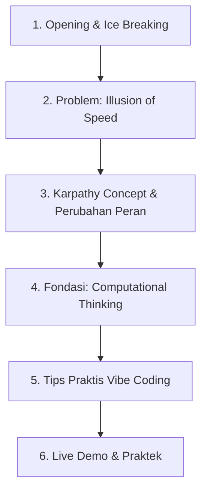

# 🎓 Patokan Ngajar: Fundamental Programming untuk Vibe Coding

> **Petunjuk Penggunaan:**  
> - **[🎯 CLUE KUNCI]**: Poin singkat ber-kategori untuk dibaca sekilas saat bicara di depan kelas/audien (0.5 detik).  
> - **[💡 DETAIL SCRIPT]**: Buka / klik jika lupa alur atau butuh contoh kalimat pasnya.

---

## 📌 Alur Materi (Sequential Flow)

---

## 1. Opening & Ice Breaking (Interaksi & Survey)

<b>🎯 CLUE KUNCI (Dibaca Sekilas saat Bicara)</b>

- 🎤 **Judul Material** — *Fundamental Programming untuk Vibe Coding*.  
- 🤖 **Interaksi Audien** — *"Temen-temen di sini AI yang paling sering dipake buat ngoding apa aja?"*  
- 💡 **Bridging** — Bukan mau adu LLM, tapi sharing *how to vibe coding* tanpa blunder.

<b>💡 DETAIL SCRIPT / CONTOH KALIMAT (Klik Jika Lupa)</b>

> "Halo temen-temen semua! Hari ini kita mau bahas tentang **Fundamental Programming untuk Vibe Coding**."  
>  
> "Sebelum masuk ke materi inti, aku mau survey santai dulu nih. Boleh di-share, temen-temen di sini AI yang paling sering dipake buat ngoding atau bantu nugas apa aja?"  
> *(Dengarkan respon audien)*  
>  
> "Wah rame banget ya, ada ChatGPT, Claude, Cursor, GitHub Copilot... Tapi di sini kita bukan mau adu mana model AI yang paling jago. Kita mau bahas fondasi utamanya: **apa sih yang perlu kita siapin dan pahami biar pas Vibe Coding tuh beneran efisien, bukan malah dapet banyak error.**"

---

## 2. Perkenalan & Problem (Illusion of Speed)

<b>🎯 CLUE KUNCI (Dibaca Sekilas saat Bicara)</b>

- 👨‍💻 **Kenalan** — Tio, Mahasiswa S2 Informatika Telkom University.  
- ⚡ **Trap: Illusion of Speed** — 5 menit beres kelihatannya, tapi pas nambah fitur / dipake user langsung jackpot bug.  
- 🚨 **Akar Masalah** — AI cuma dipake buat *shortcut ketik kode*, bukan *partner berpikir*.

<b>💡 DETAIL SCRIPT / CONTOH KALIMAT (Klik Jika Lupa)</b>

> "Kenalin aku Tio, mahasiswa S2 Informatika Telkom University."  
>  
> "Pernah ga kalian ngalamin gini: pas awal nyoba Vibe Coding, rasanya ajaib banget! 5 menit aplikasi kelihatannya udah jadi. Tapi pas mau ditambahin fitur dikit atau dipake sama user... kok malah jackpot bug di mana-mana?"  
>  
> "Nah, ini yang dinamakan **Illusion of Speed**. Kita sering kejebak ngerasa ngoding makin cepet, padahal kita cuma pake AI buat shortcut ngetik kode, bukan sebagai partner berpikir."

---

## 3. Asal Usul Vibe Coding & Perubahan Peran

<b>🎯 CLUE KUNCI (Dibaca Sekilas saat Bicara)</b>

- 🐤 **Karpathy (Awal 2025)** — Ex-Tesla & OpenAI: *"I just prompt LLM & vibe with it"*.  
- ❌ **Mitos Salah** — Vibe coding **bukan** ngoding pasrah tanpa tahu programming.  
- 🎬 **Perubahan Peran** — Dulu: *Kuli Ketik (Builder)* → Sekarang: *Sutradara (Director)*.  
- 🏗️ **Arsitektur Wajib Kuat** — Nulis kode dipercepat AI, tapi pemahaman struktur harus makin tajam.

<b>💡 DETAIL SCRIPT / CONTOH KALIMAT (Klik Jika Lupa)</b>

> "Sebenarnya istilah 'Vibe Coding' ini populer dari mana sih? Istilah ini pertama kali dipopulerkan awal tahun 2025 sama Andrej Karpathy—beliau ex-Director of AI di Tesla & Co-founder OpenAI."  
>  
> "Karpathy ngetweet kurang lebih begini: *'Sekarang kalau ngoding, aku tinggal ngomong bahasa sehari-hari ke LLM, accept suggestion, ga ngebaca tiap baris kodenya, I just vibe with it.'*"  
>  
> "Tapi banyak yang salah tangkap! Dikira Vibe Coding itu artinya 'ngoding pasrah tanpa perlu tahu dasar programming'. Padahal beda banget!"  
>  
> "Peran kita berubah:"  
> - **Dulu (Tradisional):** Peran kita kayak *Kuli Ketik*. Fokus nulis syntax, ngafalin fungsi, dan benerin error titik koma.  
> - **Sekarang (Vibe Coding):** Peran kita berubah jadi *Sutradara*. AI yang ngetik kodenya, tugas kita ngarahin alur, bikin arsitektur, dan nge-review hasilnya.

---

## 4. Fondasi Utama: Computational Thinking (4 Pilar)

<b>🎯 CLUE KUNCI (Dibaca Sekilas saat Bicara)</b>

- 💡 **Fondasi Baru** — Bukan ngafalin syntax, tapi **Computational Thinking**.  
- 🔍 **1. Abstraksi** — Fokus ke kebutuhan utama, kesampingkan detail sekunder.  
- 🧩 **2. Dekomposisi** — Pecah sistem besar jadi bagian-bagian kecil.  
- 📋 **3. Algoritma** — Susun langkah solusi dalam bahasa sehari-hari.  
- 🔁 **4. Pattern Recognition** — Kenali pola masalah/kegiatan berulang (reusable logic).  
- 📚 **Referensi** — Bebras Indonesia (bebras.or.id) & TOKI.

<b>💡 DETAIL SCRIPT / CONTOH KALIMAT (Klik Jika Lupa)</b>

> "Syntax mah serahin aja ke AI. Fondasi sesungguhnya di era Vibe Coding adalah **Computational Thinking**—kemampuan memformulasikan persoalan dan solusinya agar bisa diselesaikan oleh komputer."  
>  
> "Ada 4 tahapan utamanya:"  
> 1. **Abstraksi:** Memprioritaskan mana yang paling penting. Bedakan fitur core vs fitur pelengkap.  
> 2. **Dekomposisi:** Memecah masalah besar jadi komponen kecil (misal: frontend, backend, database).  
> 3. **Algoritma:** Menentukan urutan langkah secara sistematis. Sekarang langkah ini ga harus pake syntax ketat, cukup bahasa manusia yang jelas.  
> 4. **Pattern Recognition:** Memahami pola berulang biar ga perlu bikin solusi dari 0 tiap dapet error.  
>  
> *(Kalau mau belajar lebih dalam bisa cek bebras.or.id atau TOKI)*.

---

## 5. Tips Praktis Vibe Coding (Best Practices)

<b>🎯 CLUE KUNCI (Dibaca Sekilas saat Bicara)</b>

- 🎯 **1. Know Your App** — Paham total barang yang mau dibuat & jawab pertanyaan dasar.  
- 🗺️ **2. Planning > Eksekusi** — Bedakan fase *Eksplorasi* vs *Eksploitasi*.  
- 🎨 **3. Wireframe First** — Minta wireframe ASCII / SVG di prompt dulu.  
- ❓ **4. Prompt Kritis** — *"Apakah UI ini intuitif atau user harus baca manual?"*  
- 💻 **5. UI First** — Beresin Frontend sampai fix, baru sambungin Backend.

<b>💡 DETAIL SCRIPT / CONTOH KALIMAT (Klik Jika Lupa)</b>

> "Berikut 5 tips praktis Vibe Coding berdasarkan pengalaman bikin produk:"  
> 1. **Paham apa yang mau dibikin:** Bare minimum bisa jawab pertanyaan dasar cara kerja aplikasi kita.  
> 2. **Planning > Eksekusi:** Jangan langsung minta AI bikin seluruh kode. Bedakan mana fase eksplorasi ide vs eksploitasi eksekusi.  
> 3. **Wireframe ASCII / SVG:** Sebelum minta HTML/CSS lengkap, minta AI gambarin alur visualnya pake ASCII/SVG.  
> 4. **Prompt Kritis:** Tanya AI pertanyaan penguji, misal: *'Apakah tampilan ini sudah intuitif untuk orang awam?'*  
> 5. **Mulai dari Frontend dulu:** Pas tampilan UI udah disepakati & pas, baru diisi logika backend & API-nya.

---

## 6. Live Demo & Alur Praktek Vibe Coding

<b>🎯 CLUE KUNCI (Dibaca Sekilas saat Bicara)</b>

- 📝 **1. Spesifikkan Produk** — Tentukan requirement se-jelas mungkin.  
- 🗣️ **2. Ajak AI Diskusi** — Tanya saran framework/tech stack yang ringan (e.g. HTML/CSS/JS).  
- 📄 **3. Minta PRD Dulu** — Minta dokumen PRD dulu dari AI sebelum generate kode!  
- 🧪 **4. Stress Test & Fact Check** — Pertanyaan kritis (*"Kuat 1000 user?"*) + verifikasi jawaban AI.

<b>💡 DETAIL SCRIPT / CONTOH KALIMAT (Klik Jika Lupa)</b>

> "Nah sekarang kita masuk ke alur praktek live demo-nya:"  
> 1. **Tentukan & Spesifikkan:** Apa app yang mau kita bikin hari ini.  
> 2. **Diskusi Tech Stack:** Ajak AI ngobrol dulu, 'Aku mau bikin app A pake HTML sederhana, menurutmu struktur paling bagus gimana?'  
> 3. **Generate PRD First:** Minta AI bikin Product Requirement Document (PRD) dulu! Jangan langsung minta kodenya.  
> 4. **Generate Code Step-by-Step:** Buat kode per komponen dari PRD yang udah disetujui.  
> 5. **Tanya Pertanyaan Kritis:** Misal: *'Kalau 1000 user akses berbarengan, ini aman ga?'*  
> 6. **Fact Check:** Selalu verifikasi kode & instruksi dari AI dengan membaca dokumentasi atau riset tambahan!

